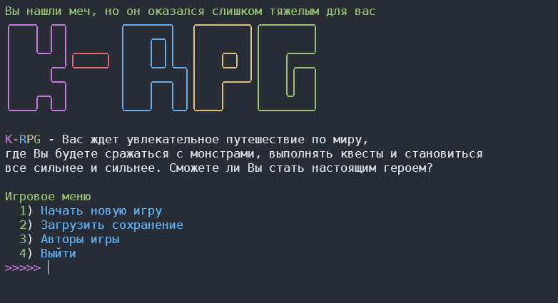
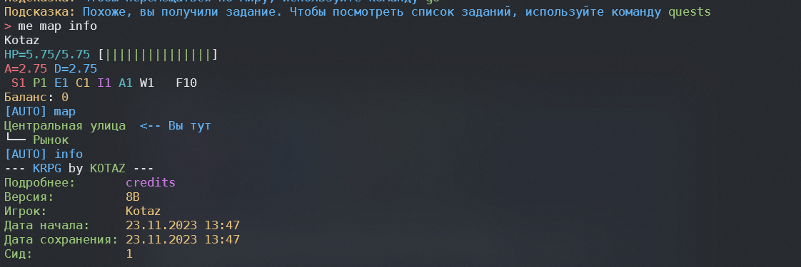
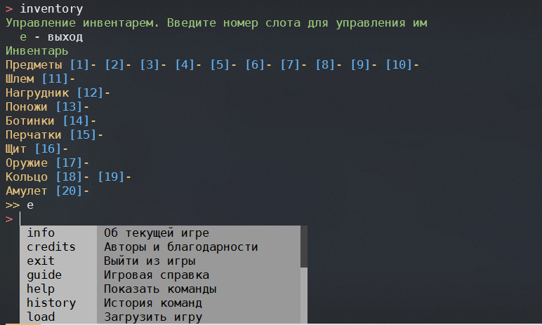

# KRPG

Моя собственная игрушка. Текстовая рпг игра на python

<p align="center">
  <a href="" rel="noopener">
 </a>
</p>

<h3 align="center">KRPG</h3>

<div align="center">

[](https://img.shields.io/badge/status-active-success.svg)
[](https://github.com/kotazzz/krpg/issues)
[](https://github.com/kotazzz/krpg/pulls)
[](/LICENSE)
[
](https://discord.gg/FKcURWZsMW)
[
](https://t.me/krpgd)
[](https://github.com/PyCQA/bandit)

</div>

---

<p align="center"> Вас ждет увлекательное путешествие по миру, где Вы будете сражаться с монстрами, выполнять квесты и становиться все сильнее и сильнее. Сможете ли Вы стать настоящим героем?
    <br>
</p>

## 📝 Table of Contents

- [Об игре](#about)
- [Установка](#getting_started)
- [Скриншоты](#gallery)
- [Авторы](#authors)
- [Информация](#acknowledgement)

## Полезные ссылки

- [Изменения](../CHANGELOG.md)
- [Contributing](../CONTRIBUTING.md)
- [Лицензия (MIT)](/LICENSE)
- [Discord](https://discord.gg/FKcURWZsMW)
- [Telegram](https://t.me/krpgd)

## 🧐 Об игре <a name = "about"></a>

**KRPG** - захватывающая приключенческая игра, где вы, исследователь-путешественник, направляетесь в деревню с целью пополнения запасов. Однако прибытие в деревню сталкивает вас с загадочными событиями, заставляя вас задержаться и помочь разгадать тайны и решить проблемы. Ваш выбор остаться открывает двери к опасным приключениям, и вы сталкиваетесь с разнообразными персонажами, каждый из которых несет свои собственные секреты. Ваше путешествие станет важным моментом в судьбе деревни, выяснить происходящее станет вашим главным вызовом. Сможете ли вы раскрывать тайны и разузнать, что же за тайны, хранит этот мир?

Я бы хотел обратить внимание на то, что я планирую сделать сюжет разнообразным настолько, насколько это возможно. В телеграми и в дискоре я делюсь иногда некоторыми идеями. Некоторые из идей которые могут появиться в игре, я решил представить и тут:

- 13 рас. Целые 13 рас, каждая из которых имеет свои особенности и уникальные способности
- Уникальные деревья способностей для каждой расы, со своими навыками и особенностями
- Документация к созданию своих сюжетов или каких либо модификаций. Возможность добавлять различные новые предметы, расы, задания посредством написания простых скриптов на специально разработанном DSL
- Более сложная система боя: я пока еще не до конца понимаю, как она должна выглядеть, но я сделаю ее более динамической, как только я изучу больше материала на эту тему. Я постараюсь выжать максимум из черного экрана и цветных букв
- Сюжетные ответвления: возможность проходить игру в разных направлениях. Свои события, квесты и возможности при прохождении игры с разными решениями
- Более динамический дизайн: я попытаюсь сделать полноценные игровые темы, доделать определенные элементы, добавить иконок и прочих декоративных интерфейсов. Постараюсь сделать игру более понятной
- Полностью переделанный дневник. Сейчас он является нестабильной функцей. но в будущем я постараюсь реализовать возможность отслеживать там определенные параметры: ключевые внутриигровые даты, отношения с нпс, предстоящие мероприятия
- Сложные предметы: ковка, улучшение, модификация различного оружия с шансами на провал. Редкость оружия и возможность находить случайные вещи в случайных местах
- Генерируемые данжи - возможность исследовать различные подземелья, в которых можно найти различные предметы и сокровища, позволяющие набрать силу перед переходом в следующий этап игрового сюжета
- Сложная система развития: помимо навыков и предметов, на развитие так же будут влиять и различные другие механики: обучение, опыт, результаты событий и различные эффекты от временных до пожизненных
- Более сложная система шкал: кроме шкалы хп я думаю над добавлением шкалы еды, усталости, маны и прочих параметров, которые будут влиять на игровой процесс
- Сложная система отношений: я планирую добавить возможность влиять на отношения с нпс, а так же добавить возможность влиять на отношения между нпс
- Сложная система магии: я планирую связать игру со своим собственным миром с собственной историей и собственной магией. Я планирую добавить возможность изучать различные заклинания
- Системы эффектов: различные зелья, алхимия и события смогут в мельчайших деталях влиять на боевые, социальные и другие навыки игрока
- Система крафта и требования к умениям: возможность создавать сложное снаряжение и предметы, которые будут требовать определенных навыков как для использования, так и для создания. Различные компоненты будут иметь различные свойства, которые будут влиять на результат, например качество, редкость, материал. Все это будет влиять на результат

Звучит заманчиво, правда? Я буду рад поддержке, критике, комментариям и любому интересу, проявлянному к моим проектам в [Телеграм](https://t.me/krpgd) и [Дискорд](https://discord.gg/FKcURWZsMW)

## 🏁 Установка <a name = "getting_started"></a>

### 💻 Linux

Установка:

```bash
pip install rich prompt_toolkit msgpack urllib3 requests
curl https://raw.githubusercontent.com/kotazzz/krpg/master/updater.py | python
```

Запуск:

```bash
python -m krpg
```

### 🪟 Windows

Скачайте установщик [отсюда](https://github.com/kotazzz/krpg/raw/master/bin/install.exe). Выберите расположение установки и запустите update.bat. После этого запустите run.bat

## 🎈 Скриншоты <a name="gallery"></a>







## ✍️ Авторы <a name = "authors"></a>

- [@kotazzz](https://github.com/kotazzz) - Идея и реализация

Смотрите полный список [контрибуторов](https://github.com/kotazzz/krpg/contributors), кто внес свой вклад

## 🎉 Информация <a name = "acknowledgement"></a>

Правила поведения можно почитать [здесь](CODE_OF_CONDUCT.md)
Я буду рад увидеть вас в своем телеграм канале, где я часто публикую интересные детали. Вот [ссылка](https://t.me/krpgd) на него.
Так же мы можем встретиться на [дискорд сервере](https://discord.gg/FKcURWZsMW)
