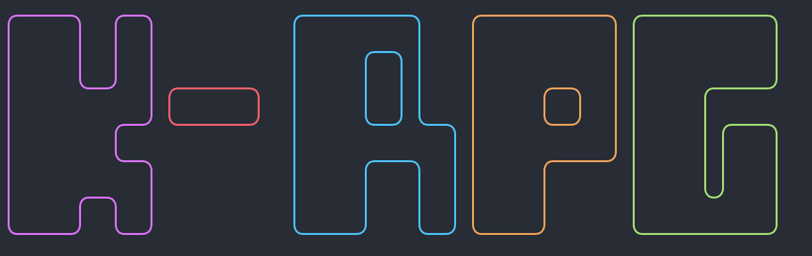

# KRPG

Моя собственная игрушка. Текстовая рпг игра на python

<p align="center">
  <a href="" rel="noopener">
 </a>
</p>

<h3 align="center">KRPG</h3>

<div align="center">

[]()
[](https://github.com/kotazzz/krpg/issues)
[](https://github.com/kotazzz/krpg/pulls)
[](/LICENSE)
[](https://discord.gg/FKcURWZsMW)
</div>

---

<p align="center"> Вас ждет увлекательное путешествие по миру, где Вы будете сражаться с монстрами, выполнять квесты и становиться все сильнее и сильнее. Сможете ли Вы стать настоящим героем?
    <br>
</p>

## 📝 Table of Contents

- [Об игре](#about)
- [Установка](#getting_started)
- [Скриншоты](#gallery)
- [Изменения](../CHANGELOG.md)
- [Contributing](../CONTRIBUTING.md)
- [Авторы](#authors)
- [Информация](#acknowledgement)

## 🧐 Об игре <a name = "about"></a>

Это проект текстовой рпг игры, написанной на языке python

## 🏁 Установка <a name = "getting_started"></a>

На данный момент игра планирует поставляться в виде архива

```
pip install rich prompt_toolkit msgpack
```

## 🎈 Скриншоты <a name="gallery"></a>

Пока что тут пусто...

## ✍️ Авторы <a name = "authors"></a>

- [@kotazzz](https://github.com/kotazzz) - Идея и реализация

Смотрите полный список [контрибуторов](https://github.com/kotazzz/krpg/contributors), кто внес свой вклад

## 🎉 Информация <a name = "acknowledgement"></a>

Я буду рад услышать все ваши пожелания и идеи на [дискорд сервере](https://discord.gg/FKcURWZsMW)
